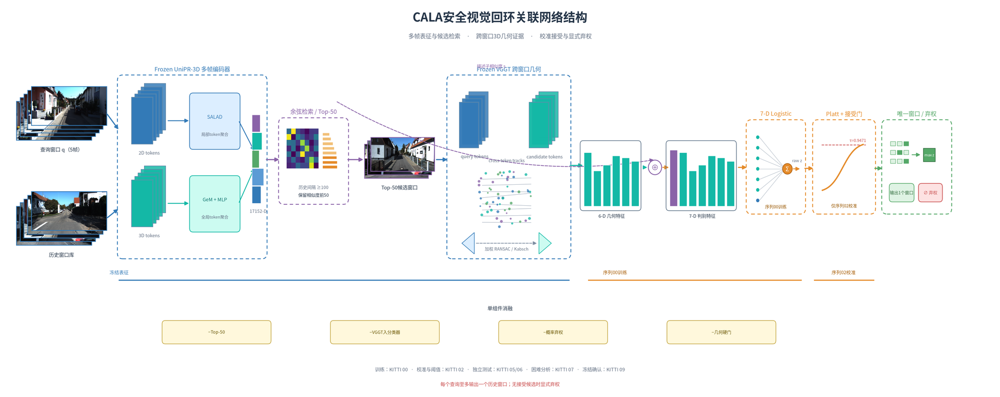
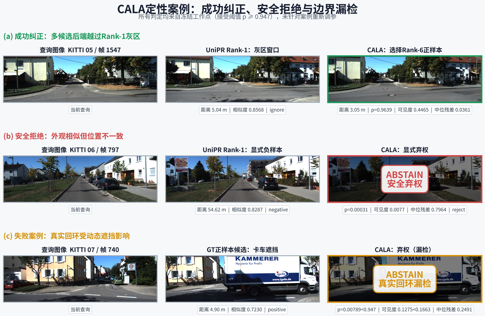
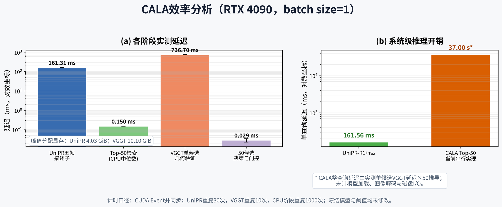

# CALA：校准弃权的回环关联

CALA（Calibrated Abstention Loop Association）判断当前 5 帧窗口是否对应**一个**历史 5 帧窗口。证据不足时直接弃权，每个 query 最多接受一个历史窗口。输出停在回环关联，不估计相对位姿，也不做 pose graph。

视觉描述子使用冻结的 [UniPR-3D](https://github.com/dtc111111/UniPR-3D)（Deng et al., ECCV 2026，arXiv:2512.21078）。几何证据使用冻结的 [VGGT](https://github.com/facebookresearch/vggt)。本仓库新增的是 KITTI 上的历史检索、cross-token 3D 特征、Logistic 决策头、Platt 校准，以及 accept / uncertain / reject 的单一窗口选择。

<p align="center">
  
</p>

<p align="center"><sub>查询窗口与历史窗口分别进入冻结 UniPR-3D，得到 17152 维描述子并做历史 Top-50 检索。每个候选再与查询组成 10 帧，送入冻结 VGGT 提取 6 维几何证据。7 维 Logistic 在序列 00 上训练，序列 02 上做 Platt 校准；通过概率门和几何硬门后，每个查询至多保留一个历史窗口。</sub></p>

## 数据与判定

图像来自 KITTI `image_2`。窗口为 center-first 的 5 帧 `[t, t-2, t-1, t+1, t+2]`，分辨率 392×518。标签只用中心帧的 X/Z 距离，只参与训练、校准和评估：

| 条件 | 标签 |
|---|---|
| 中心帧时间差 < 100 | 不进入历史检索 |
| 距离 ≤ 5 m | positive |
| 5 m < 距离 < 25 m | ignore |
| 距离 ≥ 25 m | negative |

划分在实验前固定。05、06、07、09 不参与选阈值。

| 序列 | 用途 |
|---|---|
| 00 | 训练 7 维 Logistic |
| 02 | Platt 校准，并按 pair 级加权精度 ≥ 0.99 选择接受阈值 |
| 05、06 | 独立测试 |
| 07 | 难例分析 |
| 09 | 冻结后的确认集，historical-positive query 共 17 个 |

正式系统使用 seed 17。序列 02 上的接受概率阈值是 **0.9470927362616622**。几何硬门为 track confidence ≥ 0.10931，visibility ≥ 0.16631，median 3D residual ≤ 0.34198 m。多个候选同时通过时，按时间聚类后的未校准 `raw_logit` 选择窗口。

Strict precision 把 ignore 计为错误。端到端召回的分母是该序列全部 historical-positive query。

## 定性案例

下面三个例子都来自冻结输出，接受阈值保持 `p ≥ 0.947`，没有按案例重调参数。

<p align="center">
  
</p>

- **KITTI 05，查询中心帧 1547。** Rank-1 候选落在 5.04 m 的 ignore 区。CALA 改选 Rank-6，距离 3.05 m，`p = 0.964`。
- **KITTI 06，查询中心帧 797。** Rank-1 外观相近，但距离 54.62 m，属于负样本。CALA 给出 `p = 0.0003` 并弃权。
- **KITTI 07，查询中心帧 740。** 真实回环距离 4.90 m，但卡车遮挡了重叠区域。可见度 0.127，低于硬门 0.166，`p = 0.0079`，系统弃权。这是漏检，不是误接受。

## 定量结果

显式负关联均为 0。阈值在序列 02 上冻结，下表没有使用 05/06/07/09 重新选择。

| 序列 | Strict P (%) | 端到端召回 (%) | 输出（正 / ignore / 负） |
|---|---:|---:|---|
| 05 | 99.72 | 80.13 | 359 / 1 / 0，共 360 |
| 06 | 99.61 | 95.11 | 253 / 1 / 0，共 254 |
| 07 | 100.00 | 31.67 | 19 / 0 / 0 |
| 09 | 100.00 | 70.59 | 12 / 0 / 0 |

同一划分下，描述子阈值基线 UniPR-R1+τ₀₂ 使用序列 02 上 query 级 Strict P ≥ 0.99 得到的阈值 τ = 0.86845386。它在召回上持平或更高：

| 序列 | Strict P (%) | 端到端召回 (%) | 输出（正 / ignore / 负） |
|---|---:|---:|---|
| 05 | 100.00 | 81.25 | 364 / 0 / 0 |
| 06 | 98.84 | 96.24 | 256 / 3 / 0 |
| 07 | 100.00 | 46.67 | 28 / 0 / 0 |

CALA 相对这条基线的可见差别，主要是序列 06 上更少的 ignore，以及一条可以逐项拆开的证据链。无阈值的描述子 Rank-1 会产生大量显式负关联，不作为安全基线。

单组件消融里，Top-50 主要带来召回；概率弃权是可测到的安全开关；把 VGGT 特征送入分类器后，序列 07 变得更保守。几何硬门在这个冻结点上与正式系统输出相同，没有独立增量。种子均值只统计能够完整满足官方 0.99 规则并完成迁移的 17、21、23。明细见 `UniPR-3D_ablation_tables.md` 和 `UniPR-result.md`。

## 效率

测量在 RTX 4090 上进行，batch size 为 1，5 帧，392×518。计时使用 CUDA Event 并同步。模型加载、图像解码和磁盘读写不计入。

<p align="center">
  
</p>

| 阶段 | 延迟 | 峰值显存 |
|---|---:|---:|
| UniPR 五帧描述子 | 161.31 ± 3.00 ms | 4.03 GiB |
| Top-50 检索（CPU 中位数） | 0.150 ms | — |
| VGGT 单候选几何验证 | 736.70 ± 18.54 ms | 10.10 GiB |
| 50 候选决策与门控 | 0.029 ms | — |
| UniPR-R1+τ₀₂ 每查询 | 161.56 ms | — |
| CALA Top-50 串行估计 | 37.00 s | — |

37.00 s 由实测的单候选 VGGT 时间乘以 50 得到，表示当前串行实现，不表示实时系统。

## 仓库内容

仓库包含关联实验的脚本、测试和冻结记录。权重与大规模输出留在实验机器上：

- `model/multi_model.ckpt`
- `model/VGGT-model/model.pt`
- `outputs/` 中的描述子、pair 表、三态评估和决策头

没有这些文件时，脚本不能直接重跑完整实验。

| 文件 | 作用 |
|---|---|
| `extract_kitti_descriptors.py` | 用冻结 UniPR-3D 提取 5 帧描述子 |
| `build_kitti_topk_pairs.py` | 历史 Top-50 检索 |
| `extract_kitti_cross_token_3d_full.py` | 冻结 VGGT 的 cross-token 3D 特征 |
| `train_kitti_decision_head.py` | 在序列 00 上训练决策头 |
| `evaluate_kitti_loop_association.py` | 正式 accept-only 评估 |
| `evaluate_kitti_loop_association_descriptor_threshold.py` | UniPR-R1+τ₀₂ 基线 |
| `benchmark_kitti_cala_efficiency.py` | 效率测量，不改冻结输出 |
| `kitti_frozen_baseline_2026-08-18/` | 2026-08-18 冻结记录 |
| `UniPR-3D_ablation_tables.md` | 消融表 |
| `docs/figures/` | 本页使用的结构图、案例图和效率图 |

`main_lora_multiframe.py` 等上游入口保留在仓库中，对应 UniPR-3D 自己的地点识别训练与评测。CALA 的 KITTI 结果来自上面的关联脚本。

## 引用骨干

使用其中的 UniPR-3D 描述子代码时，请引用原论文：

```bibtex
@inproceedings{deng2026unipr3d,
  title     = {UniPR-3D: Towards Universal Visual Place Recognition with 3D Visual Geometry Grounded Transformer},
  author    = {Deng, Tianchen and Chen, Xun and Li, Ziming and Shen, Hongming and Wang, Danwei and Civera, Javier and Wang, Hesheng},
  booktitle = {European Conference on Computer Vision},
  year      = {2026}
}
```
